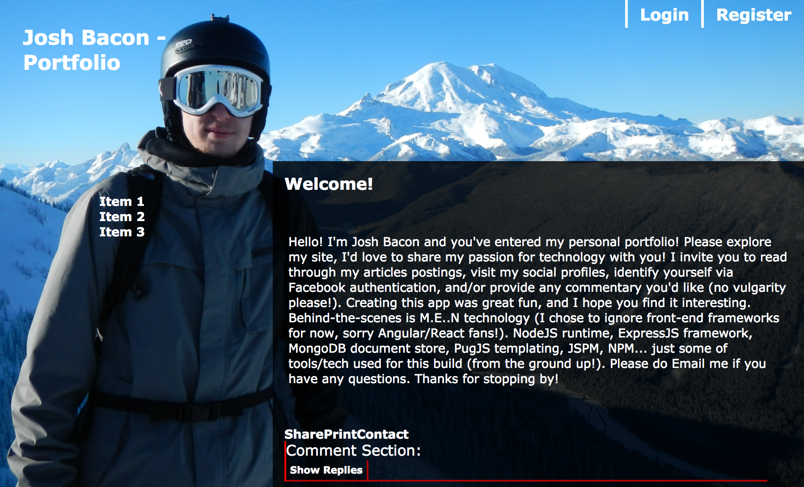

# Personal Website/Blog: [NodeJs](https://nodejs.org/en/), [ExpressJS](https://expressjs.com/), & [VanillaJS](http://vanilla-js.com/) :)

Thsi is a web app built entirely by me, Josh Bacon, for the purpose of learning javascript, nodejs, expressjs, mongodb, docker, and front/back-end web development... Attempts to use Single-Page Application patterns.

## Features to Implement:
1. Threaded Comments Section (like Reddit)
	- Backed in MongoDB!
	- Hierarchical Data Storage
	- Materialized Path? Nested Set? etc..?
	- Self-Referencing MongoDB table?
	- Document per Comment or Document for Many Comments? or both!
	- Combination thereof? (Probably best approach!)

2. Markdown Articles (Blog Entries): 
	- Backed in MongoDB!
	- Integrate Markdown Editor! (browser based...)
	- Validate against XXS, XSFR, Scripts, etc...!
	- Pictures/Images! Via S3?
3. User Accounts
	- Backed in MongoDB!
	- Facebook Authentication via passport-facebook.js
	- Local Account Registration
	- Google Authentication via passport-google.js
	- Adminstrative Account (me!)

4. About Me
	- Static Content
	- Resume
	- Social Profiles:
		- GitHub
		- DockerHub
		- LinkedIn
		- Email
		- Google
5. Donation Integration via PayPal, etc!
	- Money! 
	- But seriously.. might be fun to 
6. Email Integration
	- Forgot Password, no problem!
	- Spam! (jk)
	- Automated Email Administration & Stats:
		- Did I get a visitor!? Yay!
		- Did I get a registration/login!? Yay!
		- Did I get a million dollars!! Probably not..
7. Ads!
	- How do I accomplish this... no idea!
8. Rest API:
	- Documenting the express REST api, how to!
	- Securing the REST api!

## Future Plans:
- Host static Pages/Javascript on GitHub.io
- Host Node.JS API Server / MongoDB on AWS w/ Public Endpoint